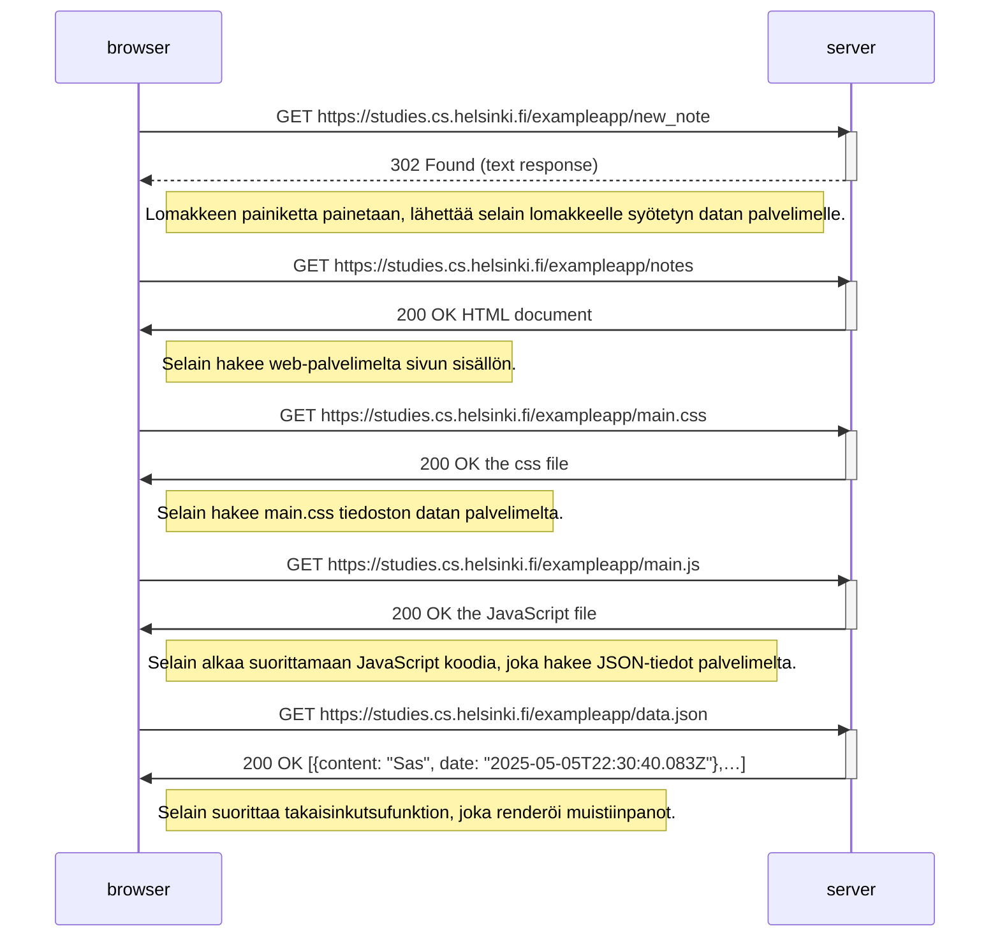
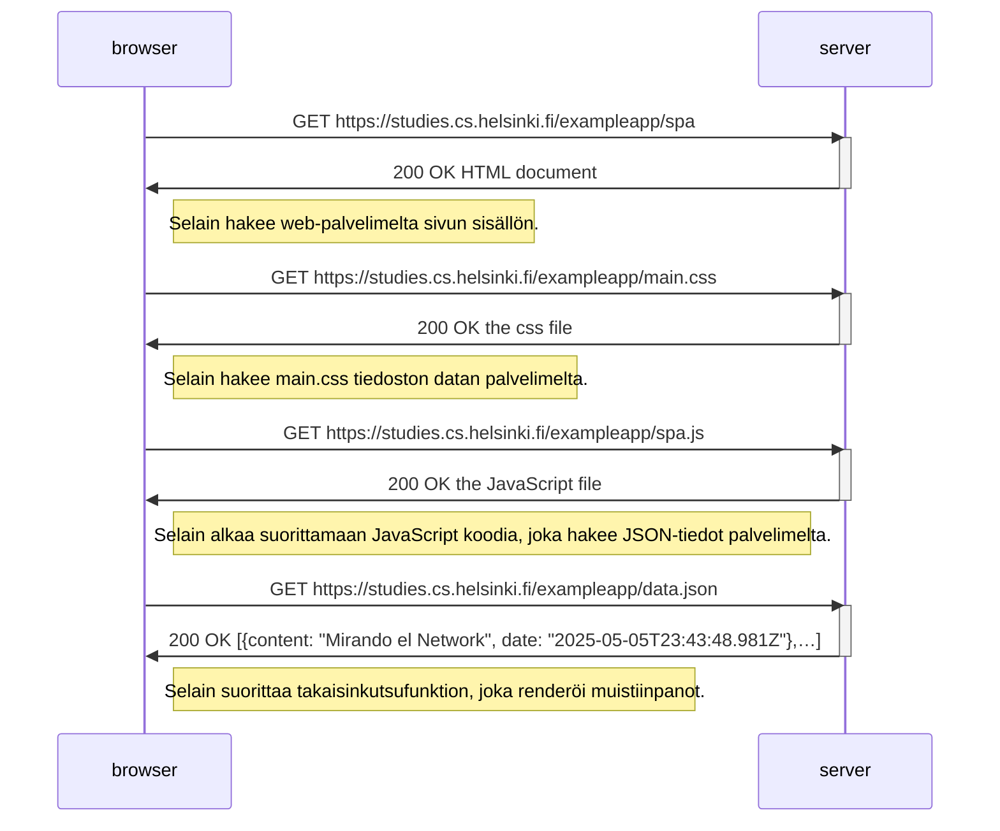
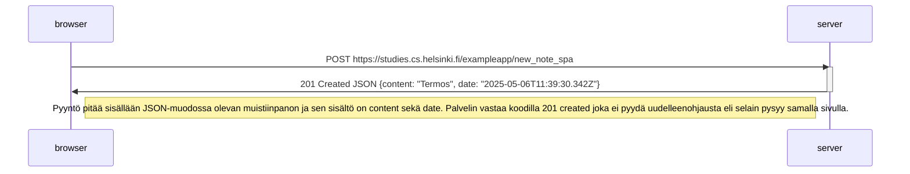

# 0.4: Uusi muistiinpano

```mermaid
sequenceDiagram
    participant browser
    participant server

    browser->>server: GET https://studies.cs.helsinki.fi/exampleapp/new_note
    activate server
    server-->>browser: 302 Found (text response)
    deactivate server

    Note right of browser: Lomakkeen painiketta painetaan, lähettää selain lomakkeelle syötetyn datan palvelimelle. 

    browser->>server: GET https://studies.cs.helsinki.fi/exampleapp/notes
    activate server
    server->>browser: 200 OK HTML document
    deactivate server

    Note right of browser: Selain hakee web-palvelimelta sivun sisällön. 

    browser->>server: GET https://studies.cs.helsinki.fi/exampleapp/main.css
    activate server
    server->>browser: 200 OK the css file
    deactivate server

    Note right of browser: Selain hakee main.css tiedoston datan palvelimelta.

    browser->>server: GET https://studies.cs.helsinki.fi/exampleapp/main.js
    activate server
    server->>browser: 200 OK the JavaScript file
    deactivate server

    Note right of browser: Selain alkaa suorittamaan JavaScript koodia, joka hakee JSON-tiedot palvelimelta.

    browser->>server: GET https://studies.cs.helsinki.fi/exampleapp/data.json
    activate server
    server->>browser: 200 OK [{content: "Sas", date: "2025-05-05T22:30:40.083Z"},…]
    deactivate server

    Note right of browser: Selain suorittaa takaisinkutsufunktion, joka renderöi muistiinpanot.
```

# 0.5: Single Page App

```mermaid
sequenceDiagram
    participant browser
    participant server

    browser->>server: GET https://studies.cs.helsinki.fi/exampleapp/spa
    activate server
    server->>browser: 200 OK HTML document
    deactivate server

    Note right of browser: Selain hakee web-palvelimelta sivun sisällön. 

    browser->>server: GET https://studies.cs.helsinki.fi/exampleapp/main.css
    activate server
    server->>browser: 200 OK the css file
    deactivate server

    Note right of browser: Selain hakee main.css tiedoston datan palvelimelta.

    browser->>server: GET https://studies.cs.helsinki.fi/exampleapp/spa.js
    activate server
    server->>browser: 200 OK the JavaScript file
    deactivate server

    Note right of browser: Selain alkaa suorittamaan JavaScript koodia, joka hakee JSON-tiedot palvelimelta.

    browser->>server: GET https://studies.cs.helsinki.fi/exampleapp/data.json
    activate server
    server->>browser: 200 OK [{content: "Mirando el Network", date: "2025-05-05T23:43:48.981Z"},…]
    deactivate server

    Note right of browser: Selain suorittaa takaisinkutsufunktion, joka renderöi muistiinpanot.
```

# 0.6: Uusi muistiinpano

```mermaid
sequenceDiagram
    participant browser
    participant server

    browser->>server: POST https://studies.cs.helsinki.fi/exampleapp/new_note_spa
    activate server
    server->>browser: 201 Created JSON {content: "Termos", date: "2025-05-06T11:39:30.342Z"}
    deactivate server

    Note right of browser: Pyyntö pitää sisällään JSON-muodossa olevan muistiinpanon ja sen sisältö on content sekä date. Palvelin vastaa koodilla 201 created joka ei pyydä uudelleenohjausta eli selain pysyy samalla sivulla. 
```